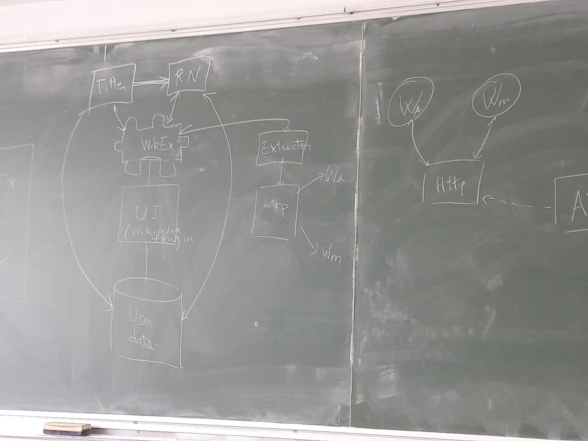

# Outline

**Title**: Wikipedia Recommender System with serendipity

1. Introduction

2. Problem overview

3. Retrieval of candidate articles

    - neighborhood:
        - naive distance
        - ontology basis
    - serendipity

4. Candidate ranking

    - possible inputs of neural network
        - category vector
        - word2vect & wikidata
    - wide & deep neural network
        - wide -> memorization/focus
        - deep -> generalization / serendipity
5. System architecture
    - 
    - dependencies
    - different features
    - *benchmarks (possibly, if there is no "experimentation" section)*

6. Experimentation (?)

    - benchmarks
    - user satisfaction

7. State of the art (1 page)

    - Recommender systems
    - Neural Networks
    - In this paper, we use wide & deep NN, already used in [Google Play article]
    - Wikipedia/Wikidata/Plugin

        - examples of popular plugins in Wikipedia (ex: one where one gets datasets stemming from studies on a subject given by a wikipedia article)
    - Serendipity
    - Distance between texts
    - Ontology

# Our recommender system

Based on the history of the articles the user read:

1. one trains the neural network on the articles already read
2. one defines a neighborhood of wikipedia articles "nearby"

    - custom distance: increases with the distance in the graph, decreases with the popularity
    - Millions of articles ⟹ intractable to score each nearby articles within a reasonable time (hundreds of milliseconds).

        - ⟶ pre-processing of articles needed: *retrieval*
3. one submits these nearby articles to the neural network

# Wide and deep neural network

*Problem*: finding a tradeoff between

- memorization (to find articles close to what the user is known to appreciate)
- generalization (to suggest articles to which the user is not accustomed: *serendipity*)

⟶ Use of wide and deep neural networks cojointly

## Wide NN

Generalized linear model:

$$y ≝ w^T x + b$$

# Retrieval of wikipedia articles

## Recommendation based on the structure of the articles

This recommender system is based on three facts, which are generally true. A wikipedia article is divided into three parts :

- *an introduction*, in which the general concepts useful to understand the notion are given

- *a table of contents*: the longer it is, the more general the article is

- *a body*, in which details are given, among which technical details and applications

We can thus assume that more precise articles are referenced in the body, whereas general ones are in the introduction. Our goal will then be to create an order over the articles read by the user, with the relation *is more general than*.

A new node in the resulting tree would be added each time the user reads a new article. Once a "stationary state" is reached, the only referenced pages will be the liked ones among the already read articles.

The idea is that, if the user wants a more general article, or does not have the basics to understand a particular one, the recommender system would branch on a more general page, being either a page in the introduction of the current page, or in the body of the previous pages. This is technically difficult, but a construction trying to avoid cycles is described here.

To recommend precise articles, we need to search among the body of an "ancestor article", whereas for more general article, an article from the introduction of an ancestor will be chosen. The chosen ancestor would be picked randomly, and the recommended article would be chosen with resort to the neural network among the set of referenced articles, but not those already visited.

Each time an article will be read, 3 binary question will be asked to the user:

1. Is this article interesting? ⟶ to update the neural network

2. Is this article too precise? ⟶ to search among ancestors

3. Is the quality of this article good? ⟶ to avoid fooling the NN

This theory has some problems:

1. cycles may appear

2. the two stated fact are not true in general

3. some "starred" articles have a long table of contents and are very complete, but we do not want to see them as very general

4. cold start

The first two problems have to be tested, but we have no proof it will be efficient

The third one may be solved, assuming that starred articles are interesting, irrespective on the fact that they are general or not: even if the person knows what it is about, a starred article is still interesting due to its quality.

The fourth one is can be solved by recommending 10 random article initially.

Two articles will be recommended: one depending on the 'precision' wanted and another one relying on serendipity, searching deeper among the ancestors.
